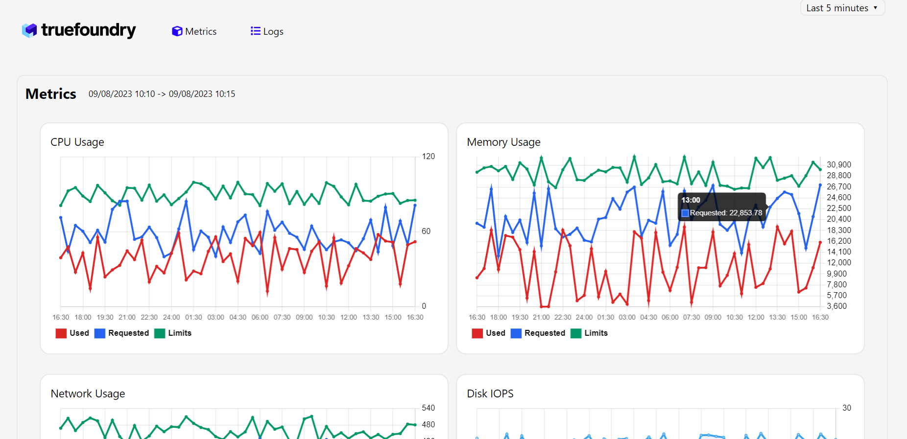

# My Awesome React Project

## Getting Started

This project was bootstrapped with [Create React App](https://github.com/facebook/create-react-app).

### Prerequisites

- Node.js and npm (or yarn) installed on your machine.

### Installation

1. Clone or download this repository.
2. Run `npm install` to install the dependencies.

### Available Scripts

- `npm start`: Starts the development server.
- `npm test`: Runs the tests.
- `npm run build`: Builds the app for production.
- `npm run storybook`: Starts Storybook.

## Features

- :rocket: Feature 1
- :sparkles: Feature 2
- :tada: Feature 3

## Screenshots

## Contributing

Contributions are welcome! Please read our [contributing guidelines](./CONTRIBUTING.md) before submitting a pull request.

## License

This project is licensed under the MIT License - see the [LICENSE.md](./LICENSE.md) file for details.
